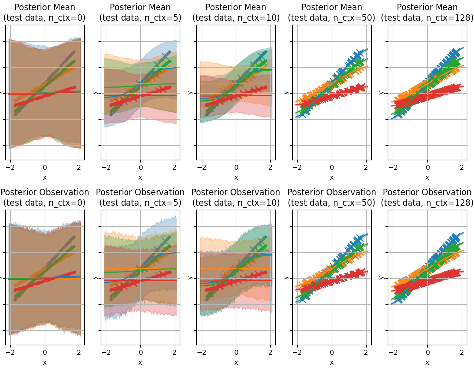

# Multi-task Bayesian Neural Networks in Pyro 
## What is this?
This is a [Pyro](https://pyro.ai) implementation of Multi-task Bayesian Neural Networks (BNNs). It allows to train BNNs on a distribution of tasks in order to distill the structure shared by the tasks in a BNN prior. Note that this project is in a very early stage of development.


## Getting Started
First install ```metalearning_benchmarks``` from [here](https://github.com/michaelvolpp/metalearning_benchmarks).

Then clone this repository and run
```
pip install . 
```
from the source directory.

To get familiar with the code, have a look at the example script ```./scripts/mtbnn/run_mtbnn.py```.

## Notes
This code is in a very early stage of development and thus not thoroughly tested. Features will change in the future. It was tested only with the packages listed in ```./setup.cfg```.

## License
This code is licensed under the MIT license and is free to use by anyone without any restrictions.

